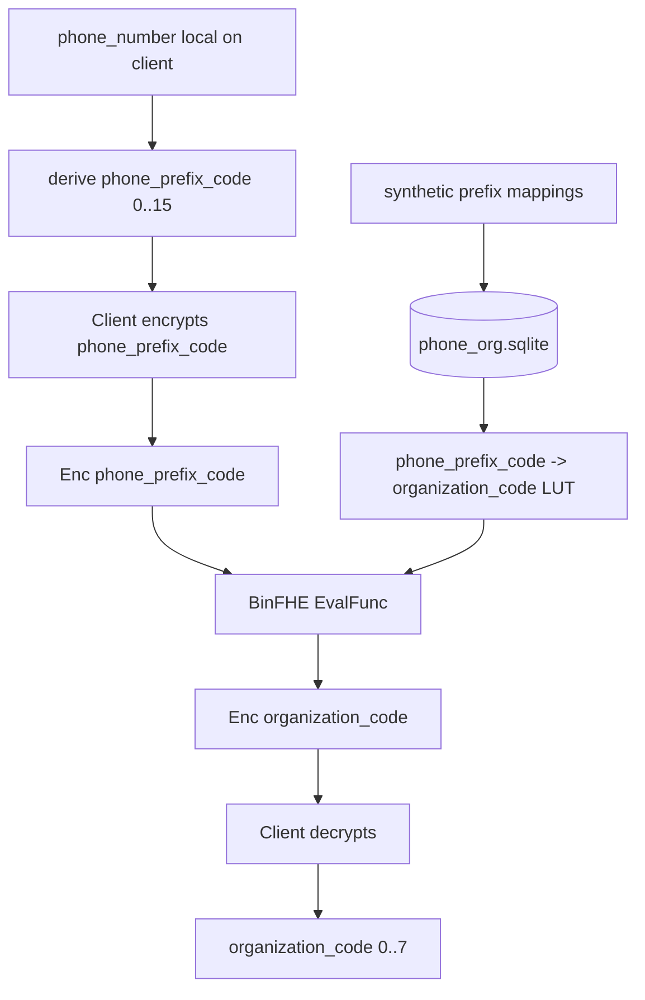

# HE Profiler Architecture Diagram

## Flow

```text
Server synthetic prefix data -> phone_org.sqlite
Client phone number -> phone_prefix_code -> BinFHE encryption
Server LUT evaluation -> encrypted organization code
Client decrypts organization code
```

## Mermaid



## Boundary

```text
Client sends:
  Enc(phone_prefix_code)
  BinFHE context/config
  BinFHE evaluation key
  LUT version

Server returns:
  Enc(organization_code)

Client keeps private:
  secret key
  plaintext phone_number
  plaintext phone_prefix_code
  decrypted organization_code
```

## Codes

```text
organization_code:
  0 Unknown
  1 Viettel
  2 VNPT/VinaPhone
  3 MobiFone
  4 Vietnamobile
  5 Gmobile
  6 Landline
  7 Other Registered
```
