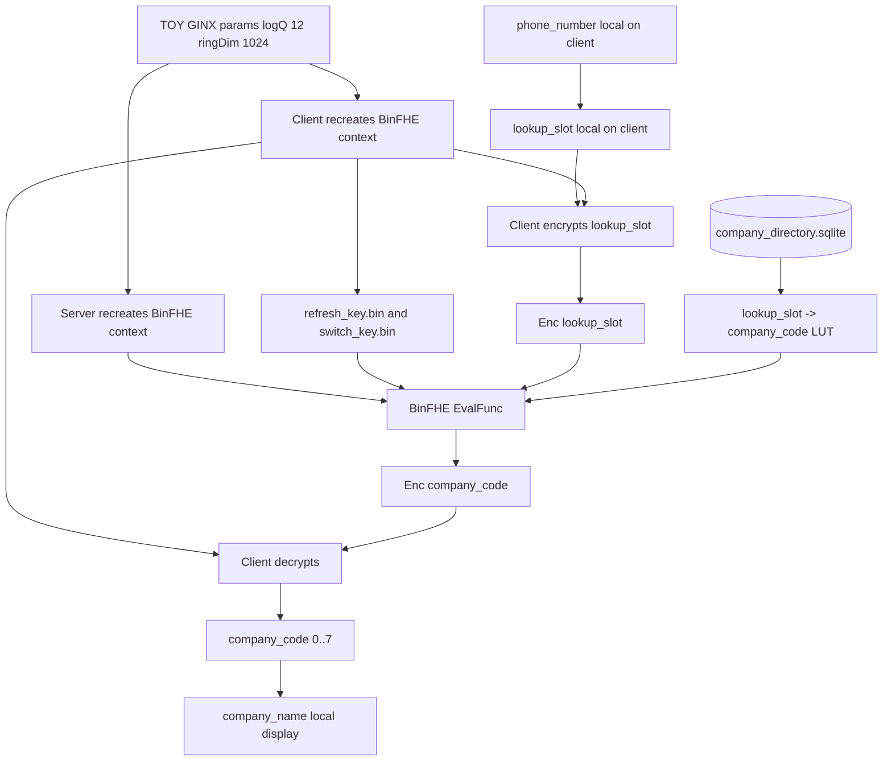

# HE Profiler Architecture Diagram

## Flow

```text
Server company directory -> lookup_slot -> company_code LUT
Client phone number stays local
Client sends Enc(lookup_slot)
Client sends refresh/switch evaluation keys
Client sends context params, not context.bin
Server evaluates BinFHE LUT
Client decrypts company_code and maps it to company_name
```

## Mermaid



## Wire Boundary

```text
Client sends to server:
  Enc(lookup_slot)
  context params in request.json
  refresh_key.bin
  switch_key.bin
  request_ct.bin
  request.json

Server returns to client:
  response_ct.bin
  response.json
```

The client and server both recreate the BinFHE context from:

```text
paramset: TOY
method: GINX
arbitrary_function: true
logQ: 12
ringDim: 1024
time_optimization: false
```

## Client Keeps Private

```text
secret key
plaintext phone_number
plaintext lookup_slot
decrypted company_code
displayed company_name
```

## Server Sees

```text
company_directory.sqlite
full lookup_slot -> company_code LUT
encrypted input ciphertext
encrypted output ciphertext
public/evaluation key material
recreated BinFHE context from request params
```

The server does not see which directory row was queried because it never sees
plaintext `lookup_slot` or `phone_number`.

## Important Limit

```text
This demo is private LUT evaluation, not full private search.
```

For a real arbitrary phone-number search where the client only has a phone
number and no directory code, use PIR, PSI, or encrypted equality/search.

## Codes

```text
company_code:
  0 No information
  1 Viettel
  2 VNPT/VinaPhone
  3 MobiFone
  4 Vietnamobile
  5 Gmobile
  6 Hanoi Landline
  7 HCMC Landline
```
