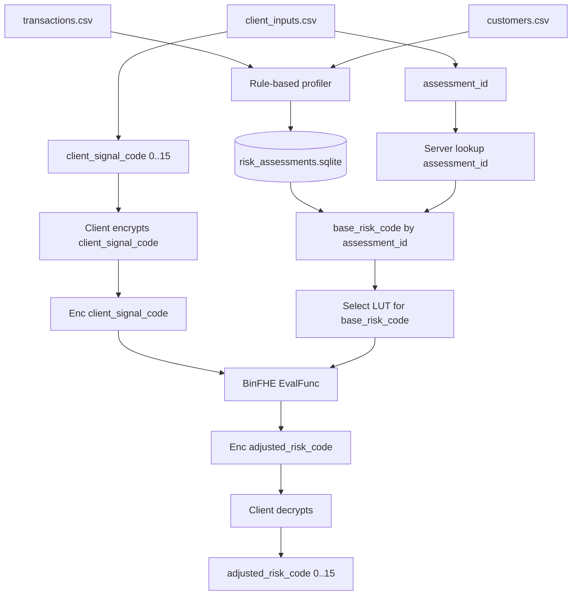

# HE Profiler Architecture Diagram

## Flow

```text
Server CSV data -> rule-based profiler -> risk_assessments.sqlite
Client signal -> BinFHE encryption -> server LUT evaluation -> encrypted result
Client decrypts final adjusted risk code
```

## Mermaid



## Boundary

```text
Client sends:
  assessment_id
  Enc(client_signal_code)
  BinFHE context/config
  BinFHE evaluation key
  LUT version

Server returns:
  Enc(adjusted_risk_code)

Client keeps private:
  secret key
  plaintext client_signal_code
  decrypted adjusted_risk_code
```
