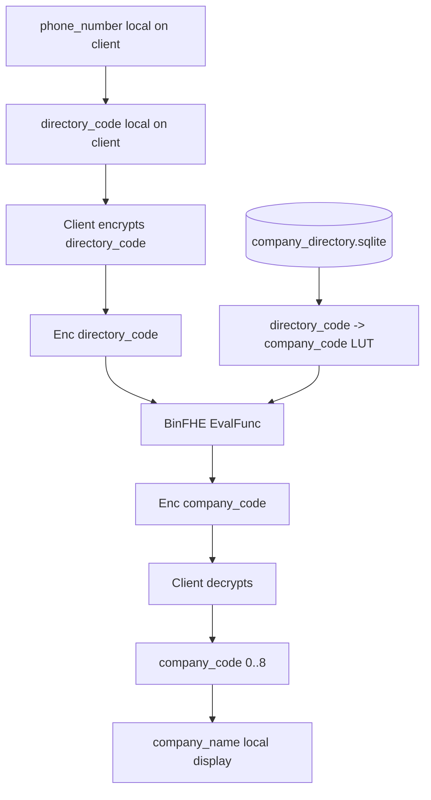

# HE Profiler Architecture Diagram

## Flow

```text
Server company directory -> directory_code -> company_code LUT
Client phone number stays local
Client sends Enc(directory_code)
Server evaluates BinFHE LUT
Client decrypts company_code and maps it to company_name
```

## Mermaid



## Wire Boundary

```text
Client sends to server:
  request_id
  lut_version
  Enc(directory_code)
  BinFHE context/config
  BinFHE evaluation key

Server returns to client:
  request_id
  lut_version
  Enc(company_code)
```

## Client Keeps Private

```text
secret key
plaintext phone_number
plaintext directory_code
decrypted company_code
displayed company_name
```

## Server Sees

```text
company_directory.sqlite
full directory_code -> company_code LUT
request_id
lut_version
encrypted input ciphertext
encrypted output ciphertext
public/evaluation key material
```

The server does not see which directory row was queried because it never sees
plaintext `directory_code` or `phone_number`.

## Important Limit

```text
This demo is private LUT evaluation, not full private search.
```

For a real arbitrary phone-number search where the client only has a phone
number and no directory code, use PIR, PSI, or encrypted equality/search.

## Codes

```text
company_code:
  0 Unknown
  1 Viettel
  2 VNPT/VinaPhone
  3 MobiFone
  4 Vietnamobile
  5 Gmobile
  6 Hanoi Landline
  7 HCMC Landline
  8 Other Registered
```
