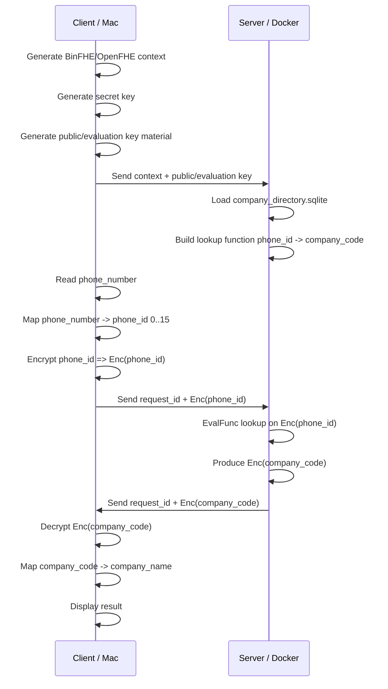
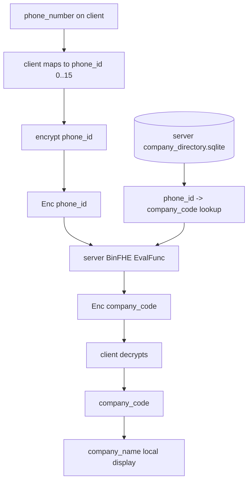

# Private Company Directory Lookup Flow

## Goal

```text
Client has a phone number.
Server has a company directory.
Server should not learn which phone number was queried.
Server should not learn the company result.
Client decrypts the result locally.
```

## Privacy Boundary

```text
Client keeps private:
  secret key
  plaintext phone_number
  decrypted company_code
  displayed company_name

Server sees:
  public/evaluation keys
  encrypted query ciphertext
  company directory
  encrypted result ciphertext

Server does not see:
  plaintext phone_number
  plaintext selected row
  plaintext company_code result
```

## Tiny First Demo

```text
directory size: 16 rows
phone_id domain: 0..15
company_code domain: 0..8
```

For the first demo, the client maps:

```text
phone_number -> phone_id
```

Later, replace this with PIR/PSI/encrypted equality if we need arbitrary phone
number search.

## End-To-End Flow



## Data Flow Diagram



## Request Format

```json
{
  "request_id": "req-0001",
  "scheme": "BinFHE",
  "context_id": "synthetic-v1",
  "ct_phone_id": "<serialized ciphertext>"
}
```

Key/context files sent or pre-shared:

```text
context.bin
eval_key.bin
```

Never send:

```text
secret_key.bin
phone_number
phone_id plaintext
```

## Response Format

```json
{
  "request_id": "req-0001",
  "scheme": "BinFHE",
  "context_id": "synthetic-v1",
  "ct_company_code": "<serialized ciphertext>"
}
```

## What The Server Computes

Plain version:

```text
company_code = company_lut[phone_id]
```

Encrypted version:

```text
Enc(company_code) = EvalFunc(Enc(phone_id), company_lut)
```

## Correctness Check

```text
plain_company_code = company_lut[phone_id]
he_company_code = decrypt(Enc(company_code))

exact_match = plain_company_code == he_company_code
```

## First Implementation Milestones

```text
1. Keep directory at 16 rows.
2. Build plaintext phone_id -> company_code LUT.
3. Client keygen + encrypt one phone_id.
4. Server EvalFunc over encrypted phone_id.
5. Client decrypt company_code.
6. Compare HE result with plaintext result.
7. Add file serialization for context, eval key, request, response.
8. Only after that consider larger private search protocols.
```

## Important Limit

```text
This first version hides which row/code was queried.
It does not yet solve arbitrary encrypted search over a raw phone number.
```

To search arbitrary raw phone numbers privately, use a bigger protocol:

```text
PIR
PSI
encrypted equality search
```
