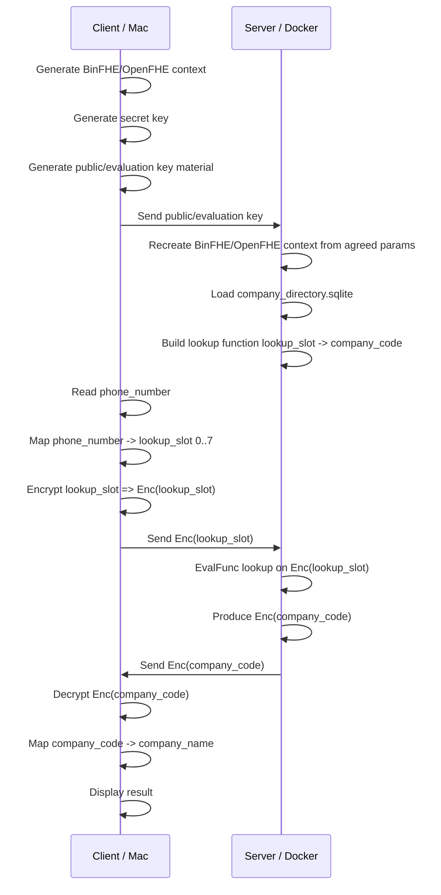
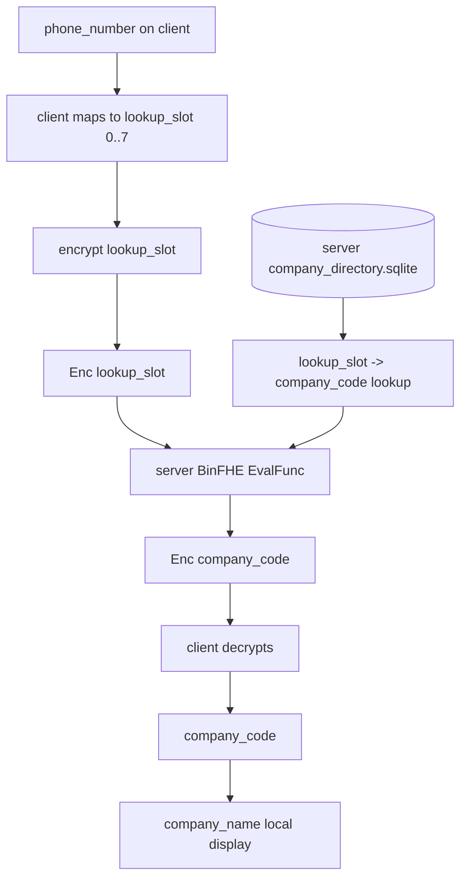

# Private Company Directory Lookup Flow

## Goal

```text
Client has a phone number.
Server has a company directory.
Server should not learn which phone number was queried.
Server should not learn the company result.
Client decrypts the result locally.
```

## Privacy Boundary

```text
Client keeps private:
  secret key
  plaintext phone_number
  decrypted company_code
  displayed company_name

Server sees:
  public/evaluation keys
  encrypted query ciphertext
  company directory
  encrypted result ciphertext

Server does not see:
  plaintext phone_number
  plaintext selected row
  plaintext company_code result
```

## Tiny First Demo

```text
directory size: 8 rows
lookup_slot domain: 0..7
company_code domain: 0..7
```

For the first demo, the client maps:

```text
phone_number -> lookup_slot
```

Later, replace this with PIR/PSI/encrypted equality if we need arbitrary phone
number search.

## End-To-End Flow



## Data Flow Diagram



## Request Format

```json
{
  "scheme": "BinFHE",
  "flow": "private_company_lookup",
  "context_id": "synthetic-v1",
  "context_params": {
    "paramset": "TOY",
    "method": "GINX",
    "arbitrary_function": true,
    "logQ": 12,
    "ringDim": 1024,
    "time_optimization": false
  },
  "encrypted_input": "lookup_slot",
  "ciphertext_file": "request_ct.bin"
}
```

Context params are pre-agreed/recreated. Key files sent:

```text
refresh_key.bin
switch_key.bin
```

Never send:

```text
secret_key.bin
phone_number
lookup_slot plaintext
```

## Response Format

```json
{
  "scheme": "BinFHE",
  "flow": "private_company_lookup",
  "context_id": "synthetic-v1",
  "encrypted_output": "company_code",
  "ciphertext_file": "response_ct.bin"
}
```

## What The Server Computes

Plain version:

```text
company_code = company_lut[lookup_slot]
```

Encrypted version:

```text
Enc(company_code) = EvalFunc(Enc(lookup_slot), company_lut)
```

## Correctness Check

```text
plain_company_code = company_lut[lookup_slot]
he_company_code = decrypt(Enc(company_code))

exact_match = plain_company_code == he_company_code
```

## First Implementation Milestones

```text
1. Keep directory at 8 rows.
2. Build plaintext lookup_slot -> company_code LUT.
3. Client keygen + encrypt one lookup_slot.
4. Server EvalFunc over encrypted lookup_slot.
5. Client decrypt company_code.
6. Compare HE result with plaintext result.
7. Print artifact sizes and fingerprints on both sides.
8. Only after that consider larger private search protocols.
```

## Important Limit

```text
This first version hides which row/code was queried.
It does not yet solve arbitrary encrypted search over a raw phone number.
```

To search arbitrary raw phone numbers privately, use a bigger protocol:

```text
PIR
PSI
encrypted equality search
```
